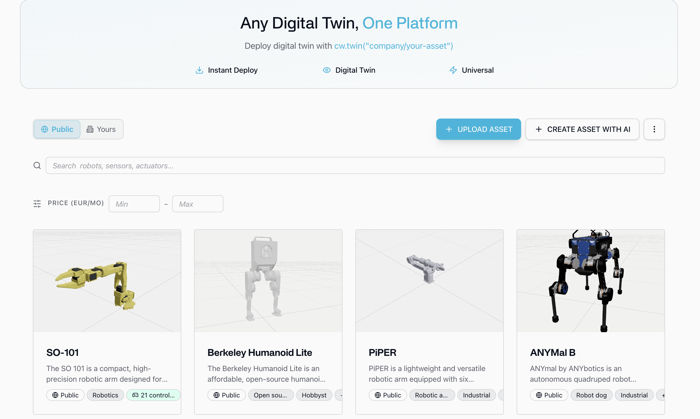

<p align="center">
  <a href="https://cyberwave.com">
    
  </a>
</p>

<h1 align="center">Cyberwave Python SDK</h1>

<p align="center">
  <b>Making the physical world programmable.</b><br/>
  Connect, control, and simulate any robot; the same code runs in simulation and on real hardware.
</p>

<p align="center">
  
</p>

<p align="center">
  <a href="https://github.com/cyberwave-os/cyberwave-python/blob/main/LICENSE"></a>
  <a href="https://docs.cyberwave.com"></a>
  <a href="https://discord.gg/dfGhNrawyF"></a>
  <a href="https://pypi.org/project/cyberwave/"></a>
  <a href="https://pypi.org/project/cyberwave/"></a>
  <a href="https://github.com/cyberwave-os/cyberwave-python/actions/workflows/test.yml"></a>
</p>

---

Cyberwave is an all-in-one platform for building and deploying intelligent physical AI agents. 
Connect a physical robot or sensor, test it in simulation, and run AI models; all through one Python SDK.
This package is the official client.

## Installation

```bash
pip install cyberwave
```

Optional features install via extras, e.g. `cyberwave[camera]` (video streaming),
`cyberwave[ml]` (vision models), or `cyberwave[zenoh]` (edge data bus). See the
[installation docs](https://docs.cyberwave.com/overview) for the full list.

## Quick Start

Get an API key from your Cyberwave instance (**Profile → API Tokens**) and export it:

```bash
export CYBERWAVE_API_KEY="your_api_key_here"
```

Then create and control your first digital twin:

```python
from cyberwave import Cyberwave

cw = Cyberwave()  # reads CYBERWAVE_API_KEY from the environment

# Create a digital twin from a catalog asset.
# Pin it to a specific twin and environment by passing their IDs (UUID or slug).
# Omit both and Cyberwave creates a "Quickstart Environment" for you automatically.
arm = cw.twin(
    "the-robot-studio/so101",
    twin_id="your-twin-uuid",                 # e.g. "acme/twins/arm-station-1"
    environment_id="your-environment-uuid",   # e.g. "acme/envs/production-floor"
)

# Place it in the scene (editor layout)
arm.edit_position(x=1.0, y=0.0, z=0.5)
arm.edit_rotation(yaw=90)  # degrees

# Move a joint by name
joint_names = arm.joints.list()
if joint_names:
    arm.set_joints({joint_names[0]: -0.2})  # radians
    print(arm.get_joints())

# Drive a locomotion twin in simulation
cw.affect("simulation")          # or cw.affect("live") for the real robot
rover = cw.twin("unitree/go2")
rover.move_forward(0.3)

cw.disconnect()
```

The same script targets real hardware by switching `cw.affect("live")`, no other changes.

## Core Concepts

- **Twins** — virtual representations of robots and sensors. You develop and test against a twin, then deploy to hardware with identical code. Instantiate any catalog asset with `cw.twin("vendor/slug")`.
- **Environments** — scenes your twins live in. Validate quickly in the browser-based Playground, or use MuJoCo for high-fidelity physics and RL.
- **Simulation vs. live** — `cw.affect("simulation")` and `cw.affect("live")` switch where commands and state go. The same code drives both.
- **Edge & cloud** — stream camera/sensor data and run AI models on the edge or in the cloud, without managing the infrastructure in between.

## Examples

Runnable scripts live in [examples/](examples) and see the [examples index](examples/README.md) for the full list.

| Example | Shows |
| --- | --- |
| [quickstart.py](examples/quickstart.py) | Create a twin, scene layout, joints, locomotion |
| [joints.py](examples/joints.py) | Read and write joint positions by name |
| [locomotion.py](examples/locomotion.py) | Velocity-style locomotion commands |
| [capture_frame.py](examples/capture_frame.py) | Grab a single camera frame from a twin |
| [camera_stream.py](examples/camera_stream.py) | Stream a camera feed over WebRTC |
| [drone_hovering.py](examples/drone_hovering.py) | Takeoff, hover, and land a flying twin |
| [workflows.py](examples/workflows.py) | List, trigger, and monitor workflows |
| [ai/yolo.ipynb](examples/ai/yolo.ipynb) | Run YOLO vision models (Colab) |

## Documentation

Full guides and the complete API reference are at **[docs.cyberwave.com](https://docs.cyberwave.com)**
([overview](https://docs.cyberwave.com/overview) ·
[API reference](https://docs.cyberwave.com/api-reference/overview)).

## Contributing

Contributions are welcome. Please open an
[issue](https://github.com/cyberwave-os/cyberwave-python/issues) or a pull request.

## Support

- **Documentation**: [docs.cyberwave.com](https://docs.cyberwave.com)
- **Issues**: [GitHub Issues](https://github.com/cyberwave-os/cyberwave-python/issues)
- **Community**: [Discord](https://discord.gg/dfGhNrawyF)

## License

Released under the [MIT License](LICENSE).
