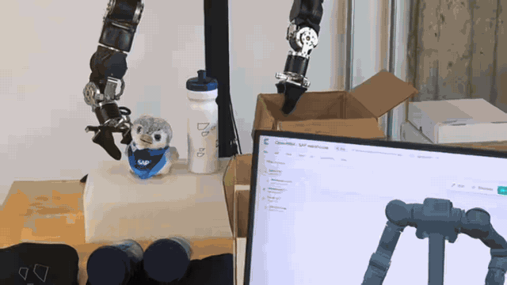

<p align="center">
  <a href="https://cyberwave.com">
    
  </a>
</p>

<h1 align="center">Cyberwave Python SDK</h1>

<p align="center">
  <b>Making the physical world programmable.</b><br/>
  Connect, control, and simulate any robot. The same code runs in simulation and on real hardware.
</p>

<p align="center">
  
</p>

<p align="center">
  <a href="https://github.com/cyberwave-os/cyberwave-python/blob/main/LICENSE"></a>
  <a href="https://docs.cyberwave.com"></a>
  <a href="https://discord.gg/dfGhNrawyF"></a>
  <a href="https://pypi.org/project/cyberwave/"></a>
  <a href="https://pypi.org/project/cyberwave/"></a>
  <a href="https://github.com/cyberwave-os/cyberwave-python/actions/workflows/test.yml"></a>
</p>

---

Cyberwave is an all-in-one platform for building and deploying intelligent physical AI agents. 
Connect a physical robot or sensor, test it in simulation, and run AI models; all through one Python SDK.
This package is the official client.

## Installation

```bash
pip install cyberwave
```

Optional features install via extras, e.g. `cyberwave[camera]` (video streaming),
`cyberwave[ml]` (vision models), or `cyberwave[zenoh]` (edge data bus). See the
[installation docs](https://docs.cyberwave.com/overview) for the full list.

## Quick Start

Get an API key from your Cyberwave instance (**Profile → API Tokens**) and export it:

```bash
export CYBERWAVE_API_KEY="your_api_key_here"
```

Then create and control your first digital twin:

```python
from cyberwave import Cyberwave

cw = Cyberwave()  # reads CYBERWAVE_API_KEY from the environment

# Create a digital twin from a catalog asset.
# Pin it to a specific twin and environment by passing their IDs (UUID or slug).
# Omit both and Cyberwave creates a "Quickstart Environment" for you automatically.
arm = cw.twin(
    "the-robot-studio/so101",
    twin_id="your-twin-uuid",                 # e.g. "acme/twins/arm-station-1"
    environment_id="your-environment-uuid",   # e.g. "acme/envs/production-floor"
)

# Place it in the scene (editor layout)
arm.edit_position(x=1.0, y=0.0, z=0.5)
arm.edit_rotation(yaw=90)  # degrees

# Move a joint by name
joint_names = arm.joints.list()
if joint_names:
    arm.set_joints({joint_names[0]: -0.2})  # radians
    print(arm.get_joints())

# Drive a locomotion twin in simulation
cw.affect("simulation")          # or cw.affect("live") for the real robot
rover = cw.twin("unitree/go2")
rover.move_forward(0.3)

cw.disconnect()
```

The same script targets real hardware by switching `cw.affect("live")`, no other changes.

## Core Concepts

- **Twins** — virtual representations of robots and sensors. You develop and test against a twin, then deploy to hardware with identical code. Instantiate any catalog asset with `cw.twin("vendor/slug")`.
- **Environments** — scenes your twins live in. Validate quickly in the browser-based Playground, or use MuJoCo for high-fidelity physics and RL.
- **Simulation vs. live** — `cw.affect("simulation")` and `cw.affect("live")` switch where commands and state go. The same code drives both.
- **Edge & cloud** — stream camera/sensor data and run AI models on the edge or in the cloud, without managing the infrastructure in between.
- **Aerial twins** — `takeoff()`, `land()`, and `hover()` record the flight state Cyberwave gates on, so a second `takeoff()` on an airborne aircraft is refused rather than sent. If you fly a drone without those helpers, record the intent with `twin.set_hovering_status(hovering=True, hovering_altitude=2.0)` (or `client.twins.set_flight_request(twin_uuid, hovering=True)`) — not with `twins.update(metadata=...)`, which overwrites the state the aircraft itself reports. See the [Drone commands](https://docs.cyberwave.com/feature-reference/drone-commands) docs.
- **GPS positioning** — a twin with a GNSS receiver can be placed in a georeferenced environment from its own fixes. Publish them with `client.mqtt.update_twin_gps(...)` (or `publish_gps()` from an edge node) and read them with `twin.gps.get_fix()`. Live only: `get_fix()` raises in simulation, because no simulation backend produces GPS. Set the environment's geo reference first — see the [Geo reference](https://docs.cyberwave.com/feature-reference/environment-editor/geo-reference) docs.
- **Drivers** — subclass `BaseDriver` (or ship `cw-driver.yml`) so the dashboard **Keyboard (Driver)** controller lists this twin's commands. Discrete commands fire once; mark locomotion `continuous` if a held key should repeat. See the [Keyboard (Driver)](https://docs.cyberwave.com/feature-reference/environment-editor/teleoperation#keyboard-driver) docs.

## Demos

Watch the SDK in action with our demos.

<table>
  <tr>
    <td width="50%">
      <a href="https://youtu.be/kUxSxCMCQgc">
        
      </a>
      <br/>
      <b><a href="https://youtu.be/kUxSxCMCQgc">Build a natural language voice agent on SO101</a></b>
    </td>
    <td width="50%">
      <a href="https://youtu.be/ITz9zMf0ObA">
        
      </a>
      <br/>
      <b><a href="https://youtu.be/ITz9zMf0ObA">Controlling a DJI Mini 4 Pro with the Cyberwave Python SDK</a></b>
    </td>
  </tr>
</table>

## Examples

Runnable scripts live in [examples/](examples) and see the [examples index](examples/README.md) for the full list.

| Example | Shows |
| --- | --- |
| [quickstart.py](examples/quickstart.py) | Create a twin, scene layout, joints, locomotion |
| [joints.py](examples/joints.py) | Read and write joint positions by name |
| [locomotion.py](examples/locomotion.py) | Velocity-style locomotion commands |
| [capture_frame.py](examples/capture_frame.py) | Grab a single camera frame from a twin |
| [camera_stream.py](examples/camera_stream.py) | Stream a camera feed over WebRTC |
| [drone_hovering.py](examples/drone_hovering.py) | Takeoff, hover, and land a flying twin |
| [workflows.py](examples/workflows.py) | List, trigger, and monitor workflows |
| [ai/yolo.ipynb](examples/ai/yolo.ipynb) | Run YOLO vision models (Colab) |

## Documentation

Full guides and the complete API reference are at **[docs.cyberwave.com](https://docs.cyberwave.com)**
([overview](https://docs.cyberwave.com/overview) ·
[API reference](https://docs.cyberwave.com/api-reference/overview)).

## Listing recordings

`recordings.list()` is paged. With no `start`/`end` it lists the most recent day
that has recordings instead of the environment's whole history, and it returns
at most `limit` rows (default `200`, fetched 50 per request). Pass `limit=0` to
follow every page.

Like the replay picker, listing excludes materializing or failed recordings by
default. Pass `include_unready=True` only when a caller needs those rows — it
requires elevated access, and the server rejects the call with HTTP 403 rather
than silently returning ready rows.

```python
items = cw.environments.recordings.list(environment_id="acme/envs/floor")
items = cw.environments.recordings.list(
    environment_id="acme/envs/floor",
    start="2026-07-01",
    end="2026-07-05",
    limit=0,
)
```

Whenever the result is partial — scoped to one day, or cut short by `limit`
while the server still had pages — `list()` logs a warning naming the window and
telling you which argument widens it, so a truncated list never looks complete.

If Cloud Run rejects a catalog response at its payload-size boundary, the SDK
raises `RecordingPayloadTooLargeError` with the affected window, cloud trace,
and a concrete retry hint. Restrict `start`/`end` or lower `limit` and retry.

### Migrating to 0.7.0

`recordings.list()` with no arguments returns the most recent day that has
recordings, rather than the environment's whole history. An unbounded listing
could exceed the API gateway's response ceiling on a busy environment and fail
with an opaque HTTP 500. It affects `twin.recordings.list()` and
`cw.environments.recordings.list()` equally.

The behavior itself shipped in **0.6.6**. `0.7.0` adds no further change to it —
the version is bumped to a minor purely to label the break, which 0.6.6 should
have done. If you are pinned to `0.6.6` you already have the new behavior; if
you are on `<= 0.6.5`, the table below is your upgrade.

| Argument | `<= 0.6.5` | `>= 0.6.6` |
| --- | --- | --- |
| `start` / `end` omitted | Every day in the environment's history | Only the most recent day that has recordings |
| `include_unready` | Materializing and failed rows included by default | `False` — ready rows only |
| `limit` | One response, server-capped at 100 rows | `200`, fetched 50 per request |

To widen the window again, name it explicitly and lift the cap. `limit=0` alone
is not enough, because the implicit single-day window is applied first, and both
bounds are required together:

```python
items = cw.environments.recordings.list(
    environment_id="acme/envs/floor",
    start="2026-01-01",           # both bounds are required together
    end="2026-07-05",
    limit=0,                      # follow every page in that window
)
```

There is no argument that means "all history": pick a `start` early enough to
cover the range you care about. Callers that only need "the latest recordings"
need no change — that is the default.

`include_unready=True` requires elevated access. Without it the server rejects
the call with HTTP 403 rather than quietly returning ready rows, so do not add
it speculatively.

## Recording readiness

Recording list items expose the server's playback assessment when it is
available. Use `is_playback_ready` before downloading artifacts, or request
unready entries explicitly while building a retry UI:

```python
items = cw.environments.recordings.list(
    environment_id="acme/envs/floor",
    include_unready=True,
)

for item in items:
    print(item.uuid, item.readiness, item.is_playback_ready)
```

`item.readiness` is `None` when connected to a server that predates this
feature. If `get()` receives a materializing response, it raises `CyberwaveError`
with the server's suggested retry interval instead of returning an empty
recording.

## Timestamped virtual camera sources

`VirtualCameraStreamer` accepts RGB arrays as before. For an asynchronous
renderer or camera, return a `CapturedVideoFrame` from `get_frame` so pixels
retain their acquisition time when the stream sends the same image again:

```python
from cyberwave.sensor import CapturedVideoFrame

# In your acquisition callback, with the source's measured clocks:
latest = CapturedVideoFrame(rgb, capture_wall_time, capture_monotonic, acquisition_id)

# Pass this callback as get_frame to VirtualCameraStreamer.
def get_frame():
    return latest
```

Create the sample once per acquisition and increase `acquisition_id` even when
the scene is stationary. Use Unix seconds for `capture_wall_time` and monotonic
seconds for `capture_monotonic`, measured when the source state is acquired,
not when rendering or encoding finishes. The sample owns a read-only RGB copy.
Return the same sample until a new acquisition, or `None` while unavailable.
Repeated sends are not fresh captures; placeholders have no capture timestamp.
This preserves source timing, but does not by itself verify recording/Replay
synchronization.

## Fetching a recording

`get()` downloads a recording's artifacts into a temp directory. A long recording
is stored as many parts; they are fetched in parallel and handed back in timeline
order whenever the server labels each part's position:

```python
with cw.environments.recordings.get(items[0]) as rec:
    rec.local_paths          # downloaded parts per stream, in playback order

# Fetch serially, or fetch less
rec = cw.environments.recordings.get(items[0], max_workers=1)
rec = cw.environments.recordings.get(items[0], path=".parquet")
```

`max_workers` defaults to 8 and is capped at 32; pass `1` for a strictly serial
fetch. The gain scales with how many parts a recording has — one stored as a
single large file gains nothing from extra workers.

`path` keeps only the artifacts whose signed URL or filename contains the given
text, so it selects by file extension rather than by stream: `".parquet"` fetches
the tables and skips `.mp4` video, which is usually most of a camera recording's
bytes. A reader whose artifact was filtered out raises rather than returning
empty.

## Contributing

Contributions are welcome. Please open an
[issue](https://github.com/cyberwave-os/cyberwave-python/issues) or a pull request.

## Support

- **Documentation**: [docs.cyberwave.com](https://docs.cyberwave.com)
- **Issues**: [GitHub Issues](https://github.com/cyberwave-os/cyberwave-python/issues)
- **Community**: [Discord](https://discord.gg/dfGhNrawyF)

## License

Released under the [MIT License](LICENSE).
