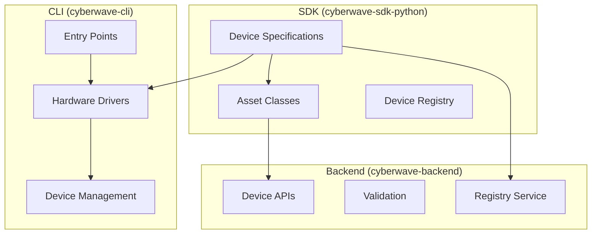

# Software-Defined Device Architecture

This document describes the revolutionary **software-defined device architecture** in the Cyberwave SDK, featuring capability flags, smart fallbacks, and intelligent deployment guidance.

## 🔧 Using device specs from the SDK

All device specifications ship inside the Python package and are available as soon as you import `cyberwave.device_specs`. The registry auto-loads built-in specs, so you can query them directly from your code:

```python
from cyberwave.device_specs import DeviceSpecRegistry
from cyberwave.device_specs.fallback import FallbackSystem

# Look up a specific device
spec = DeviceSpecRegistry.get("dji/tello")
if not spec:
    spec = FallbackSystem.get_or_create_spec("dji/tello")

print(spec.name)
print(spec.get_all_capabilities())

# List devices that include a full digital-twin stack
for complete in DeviceSpecRegistry.get_complete_devices():
    print(complete.id, complete.get_deployment_mode())
```

.. note::
   Device specs can point to fully custom twin implementations via the
   ``asset_class`` (or ``twin_class``) attribute. For example, the
   ``cyberwave/so101`` spec now resolves to ``cyberwave.assets.SO101Robot``, a
   composition of capability mixins that exposes joint helpers, scripted pick
   and place flows, and gripper controls through the compact twin API.

The same registry powers the high-level `Cyberwave` SDK client. Once authenticated you can connect specs to live environments and twins:

```python
from cyberwave import Cyberwave

client = Cyberwave(base_url="https://api-dev.cyberwave.com", token="YOUR_TOKEN")

env = client.environments.create_standalone(
    name="Spec Demo",
    description="Device spec to twin example",
    initial_assets=["dji/tello"],
)

twin = client.twins.create({
    "name": "Demo Drone",
    "registry_id": "dji/tello",
    "environment_uuid": env["uuid"],
})

client.twins.command(twin["uuid"], "move_to", {"position": [1.0, 0.0, 1.5]})
```

The client now executes long-running operations synchronously by default. If
you are already inside an asyncio loop, the same calls return
``CyberwaveTask`` instances that you can ``await`` or resolve later. The
underlying asynchronous facade remains available through
``client.async_client`` for advanced integrations.

These APIs are part of the shipping package today—no stubs or mocked interfaces—so documentation snippets map directly to the SDK you install with `pip install cyberwave`.

## 🚀 Software-Defined Devices Overview

The Cyberwave platform uses a **software-defined approach** where devices are defined by their capabilities rather than hardcoded implementations:

- **SDK**: Device specifications with capability flags (no hardware drivers)
- **CLI**: Hardware drivers and edge connectivity (actual device control)  
- **Backend**: Lightweight device specs for validation and API (no hardware dependencies)
- **Smart Fallbacks**: Automatic generic device creation for unknown hardware
- **Deployment Intelligence**: Automatic deployment mode detection and recommendations



## 📦 SDK Device Specifications

### Core Components

#### 1. Software-Defined Device Specification

```python
# cyberwave/device_specs/base.py
@dataclass
class DeviceSpec:
    """Software-defined device specification with capability flags"""
    
    # Core identification
    id: str                           # Unique device identifier (e.g., "dji/tello")
    name: str                         # Human-readable name
    category: str                     # Device category (drone, arm, sensor, etc.)
    manufacturer: str                 # Device manufacturer
    
    # Software-defined capabilities (core)
    has_hardware_driver: bool = False # Hardware driver available
    has_digital_asset: bool = False   # Digital twin asset available  
    has_simulation_model: bool = False # Simulation model available
    
    # Extended capabilities (extensible)
    extended_capabilities: Dict[str, bool] = field(default_factory=dict)
    
    # Implementation details
    driver_class: Optional[str] = None        # Hardware driver class
    asset_class: Optional[str] = None         # Digital asset class
    simulation_models: List[str] = field(default_factory=list)
    fallback_asset_class: Optional[str] = None
    
    # Device capabilities and protocols
    capabilities: List[Capability]    # Device capabilities
    protocols: List[Protocol]         # Communication protocols
    connection: ConnectionInfo        # Connection details
    setup_wizard: List[SetupWizardField]  # Interactive setup
    specs: Dict[str, Any]            # Technical specifications
```

#### 2. Device Registry

```python
# cyberwave/device_specs/registry.py
class DeviceSpecRegistry:
    """Central registry for all device specifications"""
    
    @classmethod
    def register(cls, spec: DeviceSpec) -> None:
        """Register a device specification"""
    
    @classmethod
    def get(cls, device_id: str) -> Optional[DeviceSpec]:
        """Get device specification by ID"""
    
    @classmethod
    def get_by_category(cls, category: str) -> List[DeviceSpec]:
        """Get devices by category"""
```

## 🎯 Software-Defined Capabilities

### Capability Flags System

Each device specification declares what implementations are available:

```python
# Core capability flags
has_hardware_driver: bool = True    # Physical hardware control available
has_digital_asset: bool = True      # Digital twin asset available
has_simulation_model: bool = True   # Simulation model available

# Extended capabilities (future-proof)
extended_capabilities = {
    "has_ros_driver": False,        # ROS driver available
    "has_unity_model": True,        # Unity 3D model available
    "has_mobile_app": True,         # Mobile app integration
    "has_ar_model": False           # AR/VR model available
}
```

### Deployment Modes

Based on capability flags, devices automatically get deployment modes:

- **`hybrid`**: Has both hardware driver and digital asset
- **`hardware_only`**: Has hardware driver but no digital asset
- **`digital_only`**: Has digital asset but no hardware driver  
- **`specification_only`**: No implementations available

### Creating Software-Defined Device Specifications

#### Example: DJI Tello Drone (Complete Implementation)

```python
# cyberwave/device_specs/specs/robots/dji_tello.py
@dataclass
class DjiTelloSpec(DeviceSpec):
    def __post_init__(self):
        # Core identification
        self.id = "dji/tello"
        self.name = "DJI Tello"
        self.category = "drone"
        self.manufacturer = "DJI"
        
        # Software-defined capabilities
        self.has_hardware_driver = True
        self.has_digital_asset = True
        self.has_simulation_model = True
        
        # Implementation details
        self.driver_class = "cyberwave_cli.drivers.tello.TelloDriver"
        self.asset_class = "cyberwave.assets.DjiTello"
        self.simulation_models = ["gazebo", "airsim"]
        self.fallback_asset_class = "cyberwave.assets.GenericDrone"
        
        # Extended capabilities
        self.extended_capabilities = {
            "has_ros_driver": False,
            "has_unity_model": False,
            "has_mobile_app": True
        }
        
        # Device capabilities (functional)
        self.capabilities = [
            Capability(
                name="flight",
                commands=["takeoff", "land", "emergency", "up", "down"],
                description="Flight control and movement"
            ),
            Capability(
                name="camera",
                commands=["streamon", "streamoff", "photo"],
                description="Camera and video streaming"
            )
        ]
        
        # Communication protocols
        self.protocols = [
            Protocol(type="udp", port=8889, commands=["takeoff", "land"]),
            Protocol(type="udp", port=8890, commands=["streamon"])
        ]
        
        # Interactive setup wizard
        self.setup_wizard = [
            SetupWizardField(
                name="ip_address",
                type="ipv4",
                label="Tello IP Address",
                default="192.168.10.1"
            ),
            SetupWizardField(
                name="enable_video",
                type="boolean",
                label="Enable Video Stream",
                default=True
            )
        ]
```

#### Example: Generic Camera (Fallback Implementation)

```python
# cyberwave/device_specs/specs/cameras/generic_camera.py
@dataclass
class GenericCameraSpec(DeviceSpec):
    def __post_init__(self):
        self.id = "generic/ip-camera"
        self.name = "Generic IP Camera"
        self.category = "ip_camera"
        
        # Partial implementation (no simulation)
        self.has_hardware_driver = True   # Generic driver available
        self.has_digital_asset = True     # Generic camera asset
        self.has_simulation_model = False # No simulation for generic
        
        # Fallback system
        self.driver_class = "cyberwave_cli.drivers.ip_camera.IPCameraDriver"
        self.asset_class = "cyberwave.assets.GenericIPCamera"
        self.fallback_asset_class = "cyberwave.assets.GenericCamera"
        
        # Extended capabilities
        self.extended_capabilities = {
            "has_onvif_support": True,
            "has_ptz_control": False,  # Unknown until detected
            "has_audio": False
        }
```

### Asset Integration

#### Enhanced Asset Classes

```python
# cyberwave/assets/implementations.py
class DjiTello(FlyingRobot):
    def __init__(self, **kwargs):
        super().__init__(**kwargs)
        
        # Get device specification
        self._device_spec = DeviceSpecRegistry.get("dji/tello")
        if self._device_spec:
            # Use spec for capabilities and technical specs
            self._capabilities.extend([cap.name for cap in self._device_spec.capabilities])
            self._specs.update(self._device_spec.specs)
    
    async def create_twin(self, client, project_id: str, **config):
        """Create digital twin with automatic device registration"""
        device = await client.devices.create(
            name=config.get("name", self._device_spec.name),
            device_type=self._device_spec.category,
            capabilities=[cap.name for cap in self._device_spec.capabilities],
            metadata=self._device_spec.to_dict()
        )
        return device
```

## 🔌 Third-Party Device Integration

### Creating External Device Packages

#### 1. Package Structure

```
my-company-robots/
├── pyproject.toml              # Entry points configuration
├── my_company_robots/
│   ├── __init__.py
│   ├── specs.py               # Device specifications (SDK)
│   └── drivers.py             # Hardware drivers (CLI)
└── README.md
```

#### 2. Entry Points Configuration

```toml
# pyproject.toml
[project.entry-points."cyberwave.device_specs"]
industrial_arm = "my_company_robots.specs:IndustrialArmSpec"

[project.entry-points."cyberwave.drivers"]
industrial_arm = "my_company_robots.drivers:IndustrialArmDriver"
```

#### 3. Device Specification

```python
# my_company_robots/specs.py
from cyberwave.device_specs.base import DeviceSpec, Capability, Protocol

@dataclass
class IndustrialArmSpec(DeviceSpec):
    def __post_init__(self):
        self.id = "mycompany/industrial-arm-v2"
        self.name = "Industrial Arm v2"
        self.category = "industrial_arm"
        self.manufacturer = "My Company"
        
        self.capabilities = [
            Capability(
                name="manipulation",
                commands=["move_joints", "move_cartesian", "pick", "place"],
                description="Arm movement and manipulation"
            ),
            Capability(
                name="safety",
                commands=["emergency_stop", "enable_safety"],
                description="Safety controls"
            )
        ]
        
        self.protocols = [
            Protocol(
                type="modbus_tcp",
                port=502,
                parameters={"registers": {"joints": {"start": 0, "count": 6}}}
            )
        ]
```

### Auto-Discovery and Registration

Device specifications are automatically discovered and registered when the SDK is imported:

```python
# Automatic registration in __init__.py
def _register_all_specs():
    specs = [
        DjiTelloSpec(),
        IndustrialArmSpec(),  # Third-party spec
        # ... other specs
    ]
    
    for spec in specs:
        DeviceSpecRegistry.register(spec)

_register_all_specs()
```

## 🛡️ Smart Fallback System

### Automatic Device Creation

The system automatically handles unknown devices with intelligent fallbacks:

```python
from cyberwave.device_specs.fallback import get_or_create_device_spec

# Unknown device - automatically creates fallback spec
spec = get_or_create_device_spec("unknown/industrial-camera", category="camera")
print(f"Created: {spec.name}")  # "Unknown Industrial-Camera"
print(f"Mode: {spec.get_deployment_mode()}")  # "specification_only"

# Finds generic fallback if available
spec = get_or_create_device_spec("custom/ip-cam", category="ip_camera")
print(f"Using: {spec.id}")  # "generic/ip-camera" (fallback)
```

### Deployment Intelligence

Smart deployment planning with automatic recommendations:

```python
from cyberwave.device_specs import get_deployment_recommendations

# Get intelligent deployment recommendations
recommendations = get_deployment_recommendations("dji/tello")

print(f"Device Mode: {recommendations['deployment_mode']}")  # "hybrid"
print(f"Complete: {recommendations['is_complete']}")  # True
print(f"Available: {recommendations['available_implementations']}")
print(f"Missing: {recommendations['missing_implementations']}")

# Deployment options with benefits analysis
for rec in recommendations['recommendations']:
    print(f"Mode: {rec['mode']}")
    print(f"Description: {rec['description']}")
    print(f"Benefits: {rec['benefits']}")
```

### Capability-Based Discovery

Discover devices by their software capabilities:

```python
from cyberwave.device_specs import (
    get_devices_with_hardware_drivers,
    get_devices_with_digital_assets,
    get_complete_devices
)

# Find devices with hardware drivers
hw_devices = get_devices_with_hardware_drivers()
print(f"Hardware-enabled devices: {len(hw_devices)}")

# Find complete devices (all implementations)
complete = get_complete_devices()
print(f"Complete devices: {[d.id for d in complete]}")

# Find devices by deployment mode
from cyberwave.device_specs import DeviceSpecRegistry
hybrid_devices = DeviceSpecRegistry.get_by_deployment_mode("hybrid")
```

## 🔍 Enhanced Usage Examples

### SDK Usage with Capability Awareness

```python
import cyberwave as cw

# Capability-aware device discovery
hardware_devices = cw.device_specs.get_devices_with_hardware_drivers()
digital_devices = cw.device_specs.get_devices_with_digital_assets()
complete_devices = cw.device_specs.get_complete_devices()

# Smart device spec retrieval with fallbacks
spec = cw.device_specs.find_or_create_device_spec("unknown/robot", category="ground_robot")
print(f"Deployment mode: {spec.get_deployment_mode()}")

# Enhanced asset creation with capability checks
tello_spec = cw.device_specs.get_device_spec("dji/tello")
if tello_spec.has_digital_asset:
    tello = cw.assets.DjiTello(ip="192.168.10.1")
    
    # Create digital twin with spec metadata
    client = cw.Client()
    device = await tello.create_twin(client, project_id="proj_123")
    print(f"Created twin with capabilities: {device['capabilities']}")
```

### CLI Intelligence Examples

```bash
# Smart device discovery with capability analysis
cyberwave devices discover
# Shows: Total devices, hardware drivers, digital assets, complete devices

# Analyze specific device capabilities
cyberwave devices analyze dji/tello
# Shows: Implementation status, deployment recommendations, missing components

# Validate deployment requirements
cyberwave devices validate dji/tello --requirements hardware_driver,digital_asset
# Shows: Whether requirements can be met, suggestions for missing components

# Network scan with automatic spec creation
cyberwave devices scan
# Discovers unknown devices and offers to create specifications

# Get device recommendations
cyberwave devices recommend --category drone --mode hybrid
# Shows: Recommended devices matching criteria, sorted by completeness
```

### Asset Creation with Device Specs

```python
# Enhanced asset creation
async def create_drone_fleet(client, project_id: str, count: int = 3):
    """Create a fleet of drones using device specifications"""
    
    tello_spec = cw.device_specs.get_device_spec("dji/tello")
    if not tello_spec:
        raise ValueError("Tello device spec not found")
    
    drones = []
    for i in range(count):
        # Create asset instance
        drone = cw.assets.DjiTello(
            name=f"Drone-{i+1}",
            ip=f"192.168.10.{i+1}"
        )
        
        # Create digital twin with spec metadata
        device = await drone.create_twin(
            client=client,
            project_id=project_id,
            name=f"Fleet Drone {i+1}",
            position={"x": i * 2, "y": 0, "z": 0}
        )
        
        drones.append(device)
    
    return drones
```

## 📋 Development Guidelines

### Creating New Device Specifications

1. **Inherit from DeviceSpec**: Always use the base `DeviceSpec` class
2. **Unique IDs**: Use format `manufacturer/model` (e.g., `"dji/tello"`)
3. **Complete Capabilities**: Define all device capabilities with commands
4. **Setup Wizards**: Provide interactive setup for complex devices
5. **Validation**: Implement proper configuration validation
6. **Documentation**: Include clear descriptions and help text

### Device Specification Checklist

- [ ] **ID**: Unique identifier following `manufacturer/model` format
- [ ] **Basic Info**: Name, category, manufacturer, model
- [ ] **Capabilities**: All device capabilities with command lists
- [ ] **Protocols**: Communication protocols with parameters
- [ ] **Connection**: Connection type and setup instructions
- [ ] **Setup Wizard**: Interactive configuration fields
- [ ] **Specs**: Technical specifications dictionary
- [ ] **Validation**: Configuration validation logic
- [ ] **Documentation**: URLs for documentation and support

### Asset Integration Checklist

- [ ] **Device Spec Import**: Get specification in `__init__`
- [ ] **Capability Integration**: Use spec capabilities
- [ ] **Spec Metadata**: Include spec data in twin creation
- [ ] **Fallback Handling**: Graceful degradation if spec unavailable
- [ ] **Twin Creation**: Enhanced `create_twin` method
- [ ] **Setup Wizard**: Expose setup wizard from spec

## 🚀 Best Practices

### Performance

1. **Lazy Loading**: Device specs loaded only when needed
2. **Caching**: Registry caches specifications for fast access
3. **Lightweight**: No hardware dependencies in SDK
4. **Batch Operations**: Support bulk device operations

### Maintainability

1. **Single Source**: Device specs are the single source of truth
2. **Versioning**: Use semantic versioning for device specs
3. **Backward Compatibility**: Maintain API compatibility
4. **Clear Separation**: Keep specs separate from hardware drivers

### Extensibility

1. **Entry Points**: Use Python entry points for discovery
2. **Plugin Architecture**: Support third-party device packages
3. **Standard Interfaces**: Consistent API across all devices
4. **Auto-Discovery**: Automatic registration of new devices

## 🔧 Testing

### Unit Tests

```python
def test_device_spec_registration():
    """Test device specification registration"""
    spec = DjiTelloSpec()
    DeviceSpecRegistry.register(spec)
    
    retrieved = DeviceSpecRegistry.get("dji/tello")
    assert retrieved is not None
    assert retrieved.name == "DJI Tello"

def test_asset_device_spec_integration():
    """Test asset integration with device specs"""
    tello = DjiTello()
    
    # Should have capabilities from device spec
    assert "flight" in tello.get_capabilities()
    assert "camera" in tello.get_capabilities()
```

### Integration Tests

```python
async def test_twin_creation_with_specs():
    """Test digital twin creation using device specs"""
    client = MockClient()
    tello = DjiTello(ip="192.168.10.1")
    
    device = await tello.create_twin(
        client=client,
        project_id="test_project",
        name="Test Tello"
    )
    
    assert device["device_type"] == "drone"
    assert "flight" in device["capabilities"]
```

This architecture provides a solid foundation for device management in the Cyberwave SDK while maintaining clean separation of concerns and supporting extensive third-party integration.
